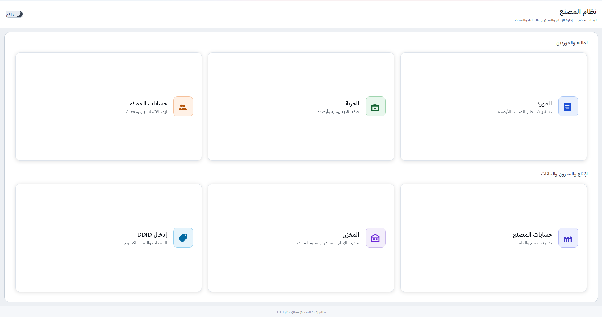
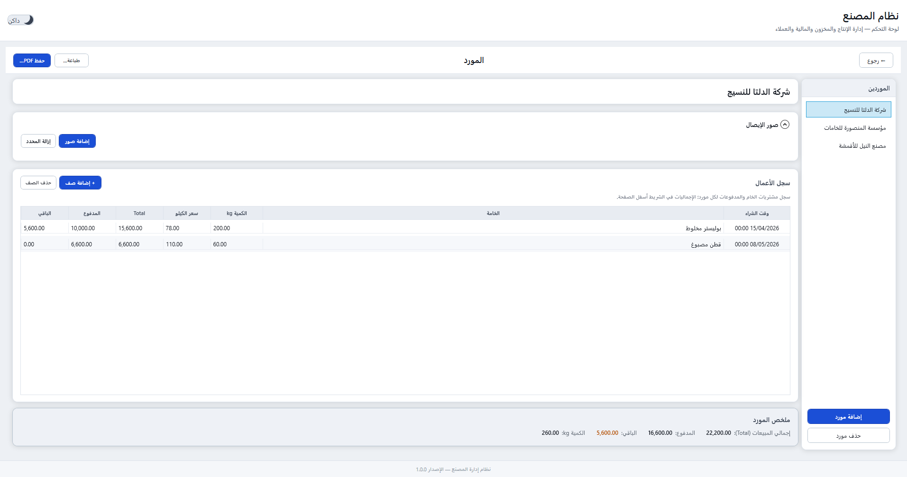
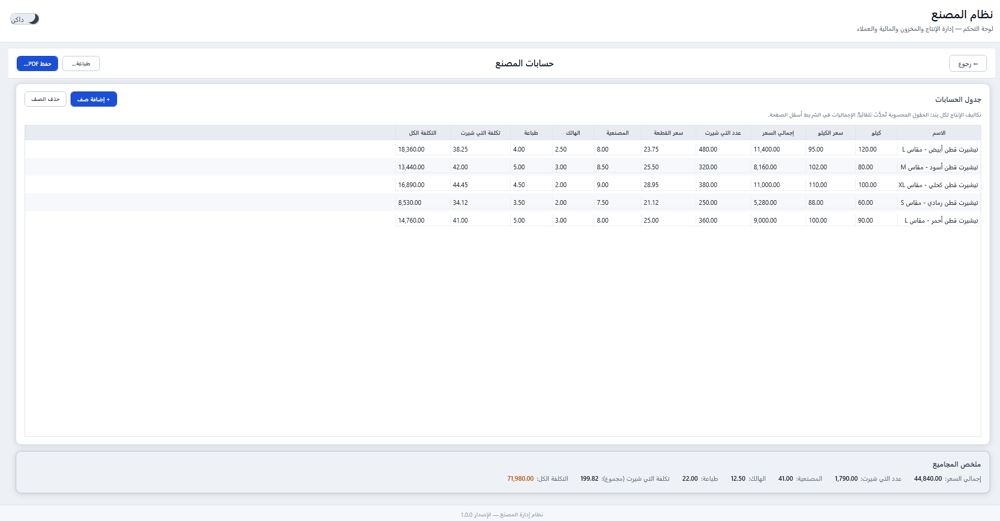
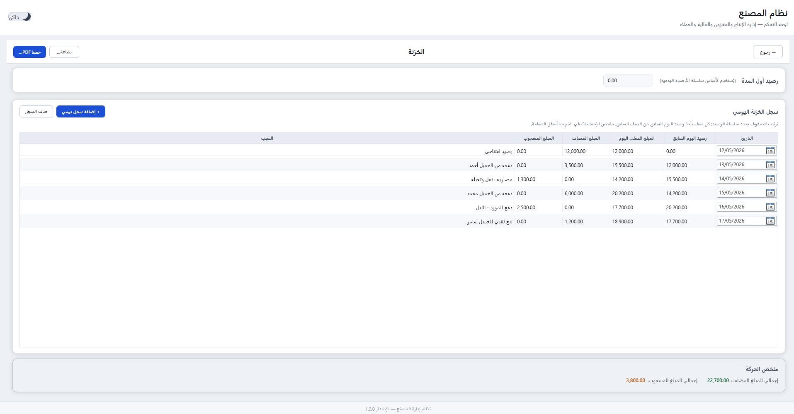
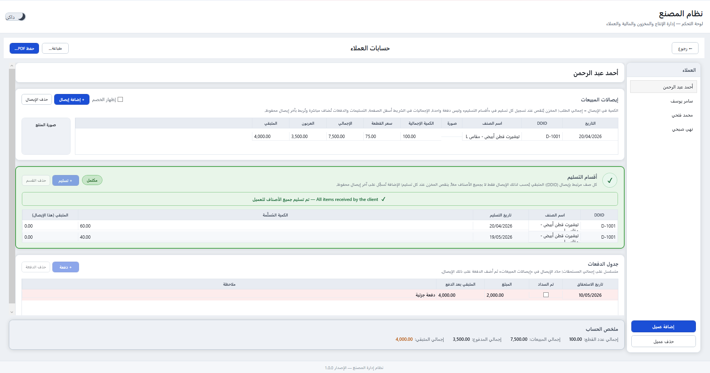
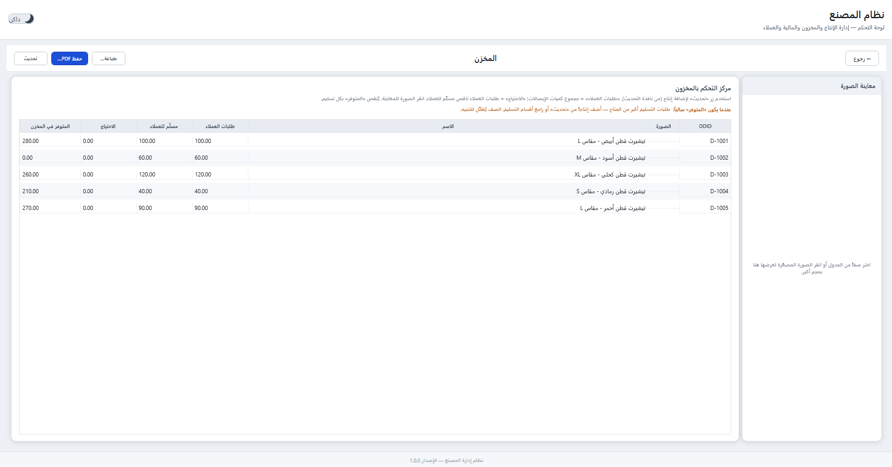
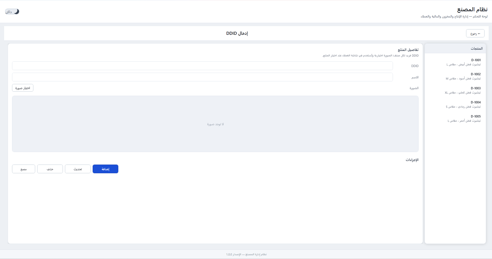
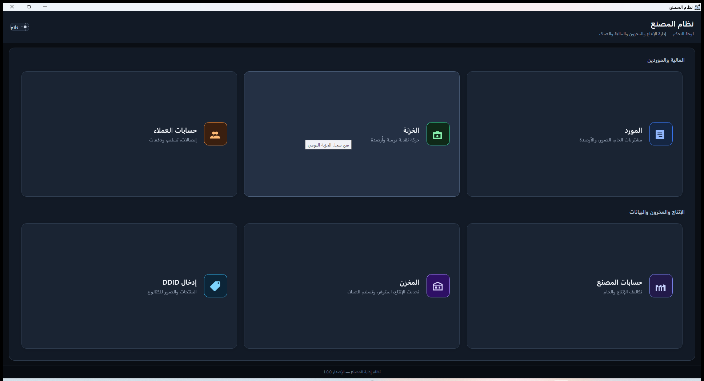

# FactoryApp

A Windows desktop app for running the day-to-day of a small T-shirt factory: suppliers, customers, the production floor, the cash safe, the warehouse, and the product catalog — all in one place, on one machine, with the data sitting next to the operator in SQLite.

Built in WPF on .NET 8. Arabic UI, English code, dark and light themes. PDFs through QuestPDF. Optional nightly-style backup to a small Node service when the user closes the app.

For a full technical reference (schema, formulas, KPIs, every module), see [`project.md`](project.md).

---

## Run it

You'll need the .NET 8 SDK and a recent Windows.

From Visual Studio:

```
Open FactoryApp.sln → F5
```

From the command line:

```bash
dotnet run --project FactoryApp/FactoryApp.csproj
```

First launch asks you to set a startup password (4 characters minimum). Every launch after that asks for it.

## Ship it

Single-file, self-contained, no .NET runtime required on the target box:

```bash
dotnet publish FactoryApp/FactoryApp.csproj -c Release -r win-x64 ^
  -p:SelfContained=true ^
  -p:PublishSingleFile=true ^
  -p:IncludeNativeLibrariesForSelfExtract=true
```

Drop the produced EXE and `appsettings.json` into the same folder on the target machine. That's the whole install.

## Configure it

`appsettings.json` lives next to the EXE. Five keys, all optional:

```json
{
  "FactoryApp": {
    "AppDataRoot": "",
    "DatabasePath": "",
    "BackupApiUrl": "https://said-production-5040.up.railway.app/upload-backup",
    "BackupEnabled": true,
    "RetainLocalBackupOnSuccess": false
  }
}
```

Leave `AppDataRoot` and `DatabasePath` empty and the app falls back to `%LocalAppData%\FactoryApp\factory.db`. Point them somewhere else if the operator wants the data on a shared drive or a USB stick.

## Where data lives

```
%LocalAppData%\FactoryApp\
├── factory.db            SQLite, everything is in here
├── device_id.txt         Stable GUID, used by the backup API
├── theme.txt             dark | light
├── Backups\              On-exit snapshots (cloud or local)
└── Logs\backup.log       Append-only, ISO-8601 UTC
```

Backups run on app exit, not on a timer. They first copy the DB to `Backups/staging/`, then POST it as `multipart/form-data` (`file` + `deviceId`) to `BackupApiUrl`. On success, the staging copy is deleted (set `RetainLocalBackupOnSuccess: true` to keep one). On failure, the staging file is left behind for retry. If the upload takes longer than 120 seconds the app gives up and shuts down anyway — nothing should block a close.

The receiver lives in [`backup-api/`](backup-api/): Node 18+, Express, Multer, deployable as-is to Railway.

## Modules

Six tiles on the dashboard. Screenshots use seeded sample data, not real factory records.



**Supplier (`المورد`)** — purchases per supplier, payments, balance owed, scanned receipt images, PDF per supplier.



**Factory (`حسابات المصنع`)** — production cost ledger. Material, labor, waste, printing, rolled up to per-shirt and total cost.



**Treasury (`الخزنة`)** — password-gated. Daily cash count chained through an opening balance. Auto-derives added vs. taken from the day-over-day delta.



**Customer (`حسابات العملاء`)** — sales receipts, partial deliveries, payment installments, running balances, delivery-status chips that go green when a receipt is fully shipped.



**Inventory (`المخزن`)** — one row per product: produced, on hand, ordered, delivered, outstanding need. Editing produced bumps stock automatically; editing deliveries on a customer receipt reduces it. Negative outstanding gets highlighted.



**DDID Entry (`إدخال DDID`)** — the master product catalog. DDID, name, photo. Everything else joins through DDID.



Every screen also ships with a dark theme — toggle from the dashboard header.



## Things worth knowing before you change code

- **Stock is wired to customer state.** Deleting a customer, editing a receipt's DDID, or removing a delivery section all walk through `InventoryRepository.AdjustStockByDdid` inside a transaction. Don't sidestep it.
- **DDID is the join key for everything physical**, but only `Products.DDID` is a real primary key. Other tables store it as plain text, looked up with `COLLATE NOCASE` and `TRIM`. Keep that in mind when you write queries.
- **The Treasury gate password is a constant in source.** It is not a security boundary, it is a "make sure you meant to click that" boundary. Treat it accordingly.
- **Migrations are idempotent.** `DatabaseInitializer` issues a handful of `ALTER TABLE ... IF NOT EXISTS`-style statements and swallows the "column already exists" errors. Old installs upgrade in place.
- **Computed columns are also stored.** `TotalPrice`, `CostPerShirt`, `RemainingAfterPayment`, and friends are written to disk *and* recomputed in the models. If you change one of the formulas, change both sides.

## Tech

| | |
|---|---|
| Runtime | .NET 8, WPF (`net8.0-windows`) |
| DB | SQLite via `Microsoft.Data.Sqlite` 10.0.5 |
| Config | `Microsoft.Extensions.Configuration` 8.0.x |
| PDF | QuestPDF 2024.7.2 (Community license) |
| Backup server | Node 18+, Express 4, Multer |

## Layout

```
.
├── FactoryApp/             WPF desktop app (this is the product)
│   ├── Models/             POCOs with INotifyPropertyChanged
│   ├── Repositories/       One per domain; each opens its own connection
│   ├── Services/           Config, password, DB init, backup, theme
│   ├── Converters/         Path → BitmapImage, negative-decimal flag
│   ├── Themes/             Dark.xaml, Light.xaml, SharedStyles.xaml
│   ├── Assets/             App icon
│   └── *.xaml(.cs)         Windows and dialogs
├── backup-api/             Node/Express endpoint for /upload-backup
├── docs/screenshots/       PNGs embedded in this README
├── project.md              Full technical reference
├── README.md               You are here
└── FactoryApp.sln
```

## License

Internal project. Code is provided as-is to the factory operator. QuestPDF is used under its Community license; check theirs if you redistribute.
